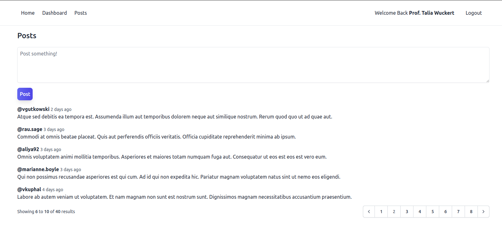

# laravel-blog-poster

Laravel project for creating and managing blog posts. Includes a user-friendly interface for adding, editing, and deleting posts, as well as basic authentication functionality.

## Project overview:



## Starting Project

1. install laravel packs

```composer
composer install
```

1. Run the following command to generate your app key:

```
php artisan key:generate
```

2. install npm and run

```npm
npm install
```

```npm
npm run dev
```

## Generate Data

```
php artisan db:seed
```

## You can start `Mailhog` by simply running the command:
```
mailgog
```

---

Need helps? Reach me out

> Email: soulaimaneyh07@gmail.com

> Linkedin: soulaimane-yahya

All the best :beer:
